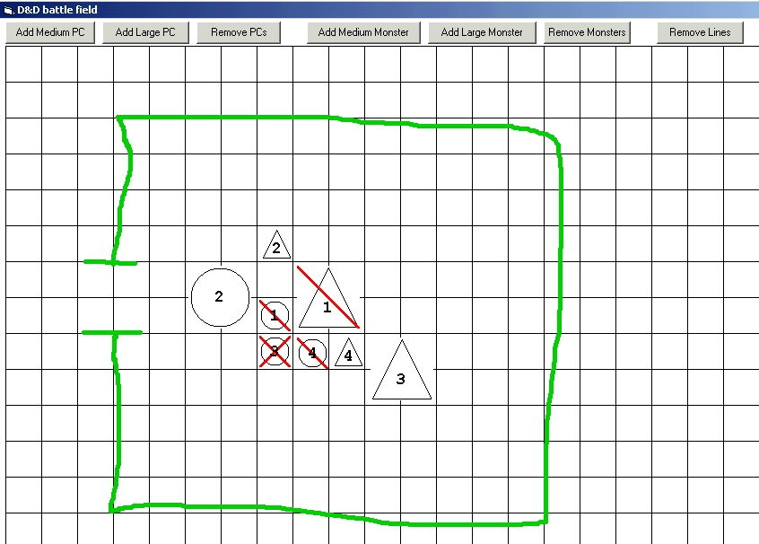



## D&D Battle Field \(updated 2004\-11\-18\)

### Description

My DM wanted a small program to simulate a battle field and display it on his big screen TV when we play. The form is about 1024x768 because his video card is able to display at that resolution on a TV. Players are represented by circles and monsters by triangles. Each players and monsters have a number to make it easy to track them. You can drag the characters where you want. Right-clicking a character toggles between healthy, wounded and dead. Left-clicking and draging on the grid allows you to draw (wall, obstacles, etc). Right-clicking on the grid is the eraser tool. I only implemented medium and large characters because other sizes are rare.

-- Updated 2004-11-16, added an icon for the eraser. -- Updated 2004-11-18, added different colors to be selected for line drawing.

Comments and votes are welcome :)
 
### More Info
 

             |
---                |---
**Submitted On**   |2004-11-18 11:27:04
**By**             |[Frédéric Côté](https://github.com/Planet-Source-Code/PSCIndex/blob/master/ByAuthor/fr-d-ric-c-t.md)
**Level**          |Intermediate
**User Rating**    |3.7 (11 globes from 3 users)
**Compatibility**  |VB 6\.0
**Category**       |[Complete Applications](https://github.com/Planet-Source-Code/PSCIndex/blob/master/ByCategory/complete-applications__1-27.md)
**World**          |[Visual Basic](https://github.com/Planet-Source-Code/PSCIndex/blob/master/ByWorld/visual-basic.md)
**Archive File**   |[D&D\_Battle18195211182004\.zip](https://github.com/Planet-Source-Code/fr-d-ric-c-t-d-d-battle-field-updated-2004-11-18__1-57094/archive/master.zip)

